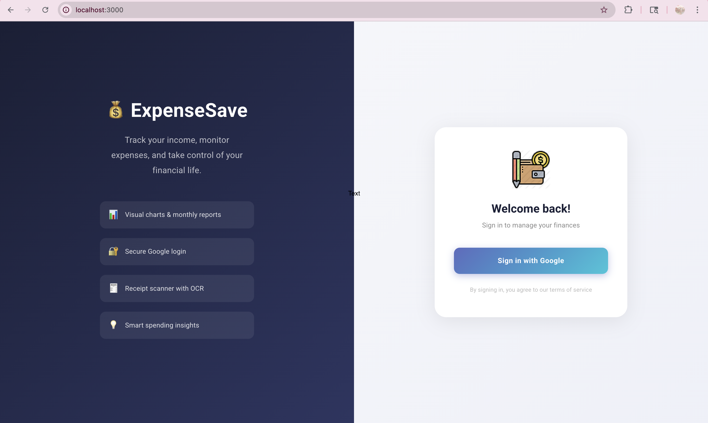
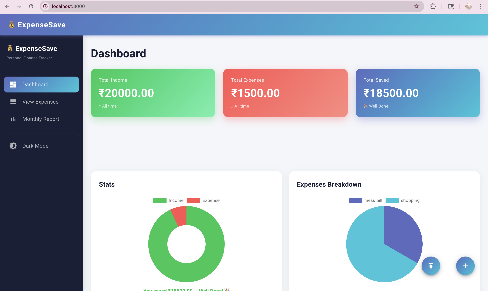
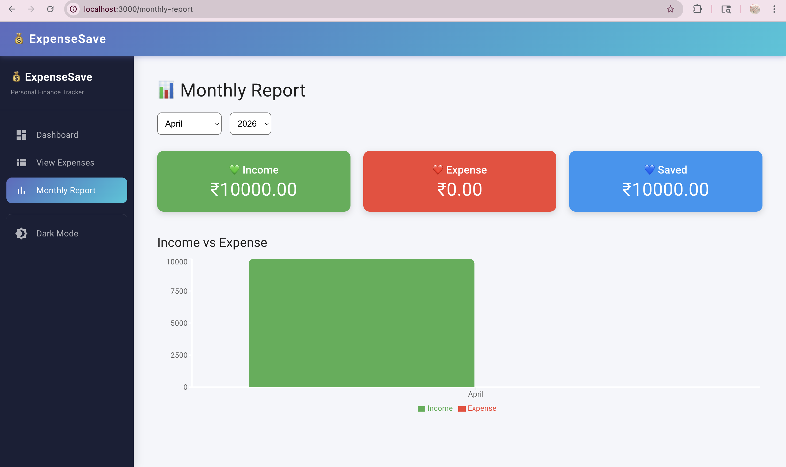

# 💰 ExpenseSave

> A smart, full-stack personal finance tracker built with the MERN stack — track your income, monitor expenses, and visualize your financial data.


---

## 📸 Screenshots

### Login Page


### Dashboard


### View Expenses


### Monthly Report


---

## ✨ Features

- 🔐 **Google OAuth 2.0** — Secure one-click login with Google
- 📊 **Visual Dashboard** — Income vs expense charts at a glance
- 📅 **Monthly Reports** — Filter by month/year with bar and pie charts
- ➕ **Add Transactions** — Log income and expenses with category and date
- 🧾 **Receipt Scanner** — Upload a receipt image and auto-extract data using OCR
- 🗑️ **Delete Transactions** — Remove any entry instantly
- 🌙 **Dark / Light Mode** — Easy on the eyes, any time of day
- 📱 **Responsive Design** — Works on desktop and mobile

---

## 🛠️ Tech Stack

| Layer | Technology |
|---|---|
| Frontend | React.js, Recharts, Chart.js, Material UI |
| Backend | Node.js, Express.js |
| Database | MongoDB, Mongoose |
| Authentication | Passport.js, Google OAuth 2.0 |
| OCR | OCRSpace API |
| Session | Cookie-Session |

---

## 🚀 Getting Started

### Prerequisites
- Node.js installed
- MongoDB Atlas account
- Google Cloud Console project with OAuth 2.0 credentials
- OCRSpace API key (free at ocr.space)

### 1. Clone the repository
```bash
git clone https://github.com/kritiarora01/ExpenseSave.git
cd ExpenseSave
```

### 2. Create `config/config.env`
```env
MONGO_URI=your_mongodb_connection_string
PORT=8000
clientID=your_google_client_id
clientSecret=your_google_client_secret
cookieKey=any_random_secret_string
```

### 3. Install dependencies

**Backend:**
```bash
npm install
```

**Frontend:**
```bash
cd frontend
npm install --legacy-peer-deps
```

### 4. Run the app

**Backend (port 8000):**
```bash
node index.js
```

**Frontend (port 3000):**
```bash
cd frontend
npm start
```

### 5. Google OAuth setup
In [Google Cloud Console](https://console.cloud.google.com):
- Add `http://localhost:8000/auth/google/callback` as authorized redirect URI

---

## 📁 Project Structure
ExpenseSave/
├── config/
│   ├── db.js
│   └── passport-setup.js
├── controllers/
│   └── expenses.js
├── models/
│   ├── user.js
│   └── expense.js
├── routes/
│   ├── auth.js
│   └── expense.js
├── frontend/
│   └── src/
│       ├── components/
│       ├── context/
│       └── styles/
└── index.js

---

## 🔒 Security
- Environment variables never committed to repository
- Google OAuth handles all authentication
- Sessions encrypted using cookie-session

---

## 👩‍💻 Author

**Kriti Arora**
- GitHub: [@kritiarora01](https://github.com/kritiarora01)

---

> ⭐ If you found this project helpful, give it a star!